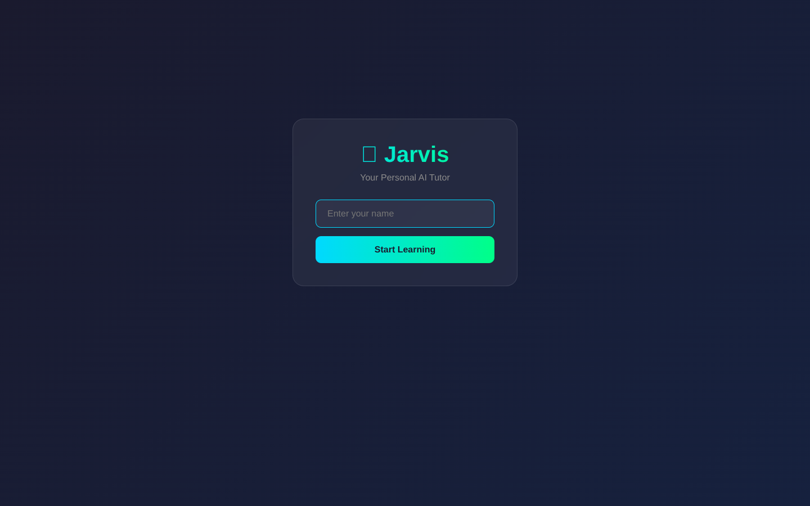

# Jarvis AI Tutor

A self-hosted, multi-user AI tutoring platform that runs entirely on local hardware. A FastAPI backend orchestrates a local Qwen2.5:7b-instruct model (served by Ollama) to assess each learner's prior knowledge, generate a personalized curriculum, deliver interactive lessons, and quiz them at module boundaries. A persistent, Claude Code-style memory system keeps per-user profiles, feedback, session logs, and references on disk so the tutor remembers each learner across sessions. The React frontend is bundled and served by the backend, and the server binds to the LAN so any device in the household can use it.

## Why

Off-the-shelf AI tutors are cloud-only, send every interaction to a vendor, charge per seat, and treat each conversation as a blank slate. This project was built to give a single household a private, no-subscription tutor that runs on a workstation already capable of hosting a 7B model, gives each family member their own learning track, and accumulates real long-term memory of what the learner knows, what they have struggled with, and where they are in each curriculum. It also doubles as a working reference implementation for grounding an LLM with a file-based memory layer instead of a vector database.

## Features

- Local-only LLM inference via Ollama (no data leaves the machine)
- Per-user accounts with isolated memory directories created on first login
- Onboarding assessments: 6-10 generated MCQs per topic, scored by subtopic to identify weak vs. strong areas
- Personalized curriculum generation that adapts to assessment gaps and a stated goal (e.g. "pass Security+")
- Module-level interactive teaching plus auto-generated quizzes with per-question feedback
- Wrong-answer tracking with a `needs_reteach` queue persisted in `progress.json`
- Claude Code-style four-file memory system per user: `user_profile.md`, `feedback.md`, `project.md`, `reference.md`
- LAN accessible (`0.0.0.0:8000`) so phones, tablets, and other PCs can connect
- Single-process deployment: backend serves the built React app from `frontend/dist`

## Tech Stack

- Python 3.9+
- FastAPI >= 0.109
- Uvicorn >= 0.27
- httpx >= 0.26 (async Ollama client)
- Pydantic >= 2.5
- React 18.2 + Vite 5
- Axios 1.6
- Ollama running `qwen2.5:7b-instruct`

## Setup

Prerequisites: Python 3.9+, Node.js 18+, and [Ollama](https://ollama.com/) with the model pulled:

```bash
ollama pull qwen2.5:7b-instruct
ollama serve
```

Backend:

```bash
cd backend
pip install -r requirements.txt
```

Frontend (built once, then served by the backend):

```bash
cd frontend
npm install
npm run build
```

Run the server:

```bash
cd backend
python main.py
```

Then open `http://localhost:8000` (or `http://<host-ip>:8000` from another device on the LAN). On Windows, `start.bat` in the repo root will build the frontend if needed and launch the backend.

For frontend development with hot reload, `npm run dev` in `frontend/` proxies `/api` to `localhost:8000`.

## Architecture

The system is a single FastAPI process that exposes a JSON API under `/api/*` and serves the bundled React SPA from `frontend/dist` at the root. All LLM calls are proxied to a local Ollama instance at `http://localhost:11434/api/chat`. Each request flows through one of three pipelines: assessment generation (low temperature, JSON-array output parsed with regex), curriculum/lesson generation (medium temperature, Markdown output), or interactive chat (higher temperature, conversational).

Persistence is filesystem-based, not a database. The `MemorySystem` class in `backend/main.py` owns a per-user directory tree containing four Markdown memory files, a `lesson_plans/` folder of generated curricula, and a `progress.json` that holds the active onboarding state, completed modules, topic assessments, and the re-teach queue. On `/api/chat` the backend loads the user's memories and the active topic's curriculum and prepends them as context, giving the model continuity across sessions without retraining or embeddings.

## Screenshots



> Additional screenshots (assessment, lesson, progress dashboard) require the FastAPI backend + Ollama running and will be added with the next capture pass.

## License

MIT - see [LICENSE](LICENSE).
